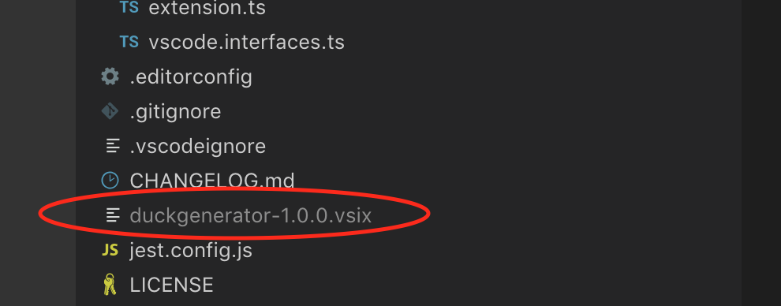
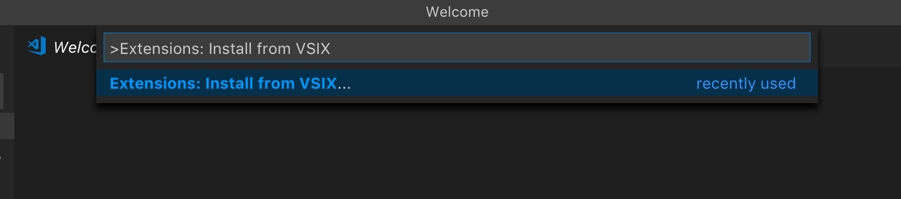
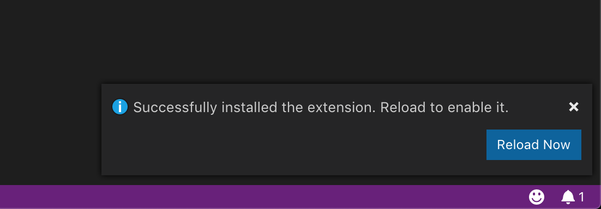
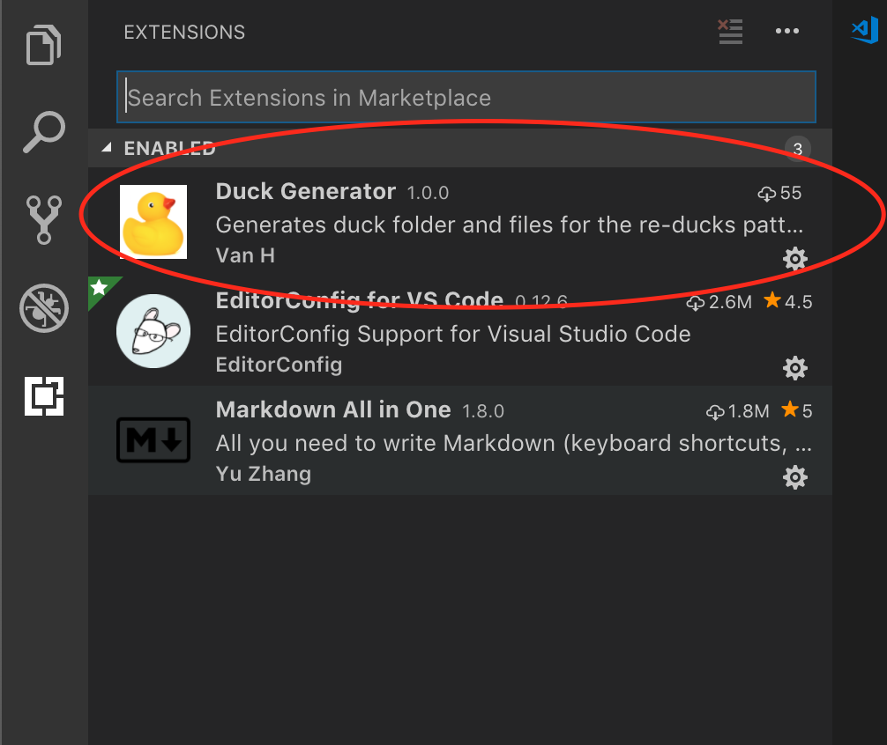

# Duck Generator - Development

## Setup

Packages: 

- Install the `vsce` package: `npm install -g vsce`.
  - This package is used to package and publish the extension.
  
Run `npm install` to restore all of the dependencies.

## Testing

Run the following scripts:

- `npm test` to execute the unit tests.
- `npm run test:coverage` to execute the unit tests and produce a coverage report.
- `npm run test:integration` to run the integration test suites (not implemented).

## Packaging/extension local testing

To Test the extension locally:

1. Package the extension by running: `npm run vscode:package`.
This will produce a file called `duckgenerator-1.x.x.vsix` in the project root folder.

2. Open a new VS Code window and bring up the command palette: `View > Command palette...` or `Command+Shift+P or Ctrl+Shift+P (macOS/Windows)`.

3. Search for: `Extensions: Install from VSIX...` and hit enter.

4. Navigate to the extension (`<project_root>/duckgenerator-1.x.x.vsix`) and select it.

5. Click the `Reload Now` button.

6. Check the extensions sidebar to see that the extension is listed in the `ENABLED` section.

7. Begin testing the extenson!

8. Remember to remove it when you are done testing.

## Publishing

// TODO
