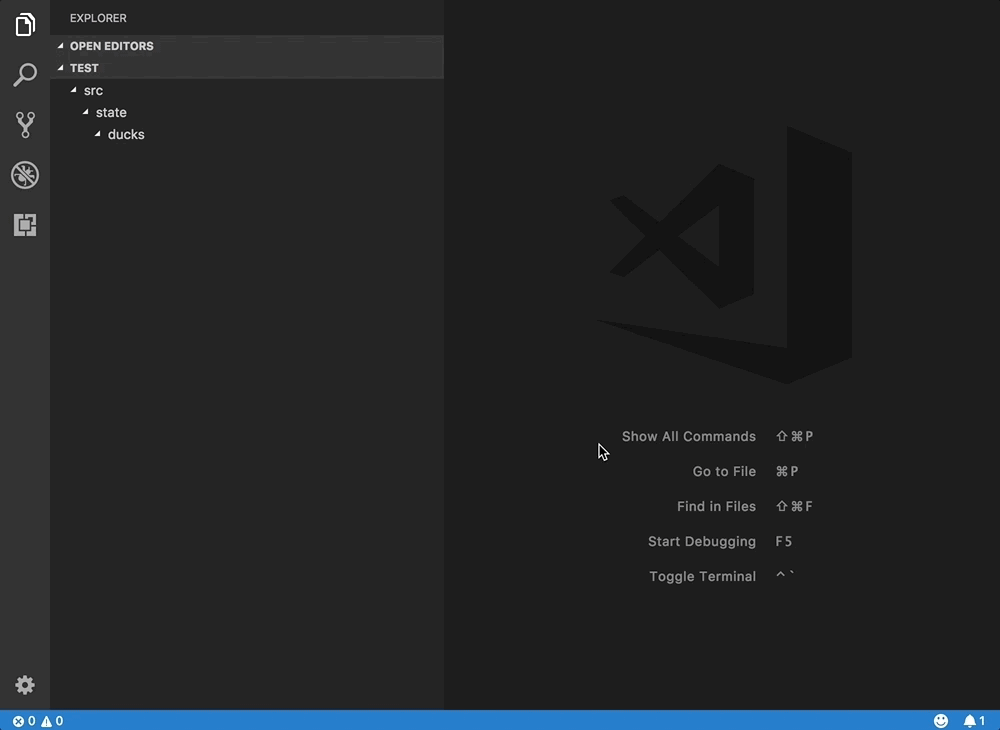
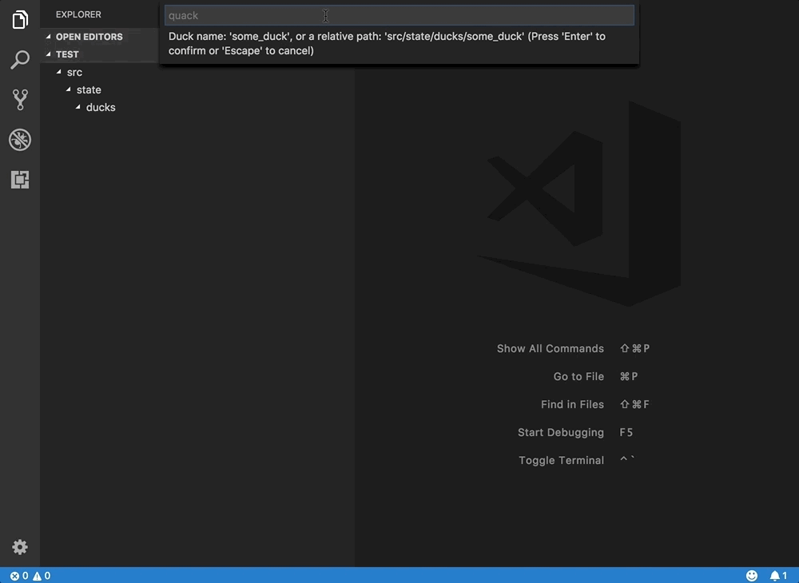

# Duck Generator

Utility to generate ducks for managing state in Redux using the [re-ducks](https://github.com/alexnm/re-ducks) pattern.

A duck contains the following files:
- `actions.js`
- `index.js`
- `operations.js`
- `reducers.js`
- `selectors.js`
- `tests.js`
- `types.js`
- `utils.js // will not be generated, by default`

## Usage

Open the command palette (macOS: `Shift+Command+P`, Windows: `Ctrl+Shift+P`) and type, "Generate Duck."



Type the name of the duck and hit enter.



Alternatively you can specify a relative path to a ducks folder that already exists.


## Configurations

Add a `ducks.config.js` to your project root to override default behaviors.

Export an object with the following options:

```
// sample `ducks.config.js` file with default values.
module.exports = {
  ext: '.js',
  root: 'src/state/ducks',
  createRoot: true,
  files: [
    'operators', 
    'selectors', 
    'actions', 
    'reducers', 
    'types', 
    'test', 
    'index'
  ],
  additionFiles: []
};
```

### Options

- `ext`: The extension to use.
  - Default: `'.js'`
- `root`: The root directory of the ducks.
  - Default: `'src/state/ducks/'`
- `createRoot`: True, to create the `root` ducks folder, false otherwise.
  - Defaults: `true`
- `files`: An array of files to generate.
  - Default: `['operators', 'selectors', 'actions', 'reducers', 'types', 'test', 'index']`
- `additionalFiles`: An array of additional files to generate on top of the duck files.
  - Default: `[]`

## Known Issues

## Source

[GitHub](https://github.com/vanister/duck-generator)

## License

[MIT](https://raw.githubusercontent.com/vanister/duck-generator/master/LICENSE)


